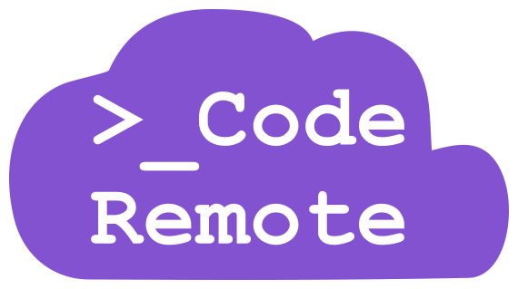

# CodeRemote.dev 


Source for [coderemote.dev](https://coderemote.dev). Built on AstroJS, and uses https://github.com/matt765/Tailcast as a template.

##  Project Structure
```
├── public/
│   └── favicon.svg
├── src/
│   ├── assets
│   │   ├── icons
│   │   ├── images
│   │   └── logos
│   ├── components
│   ├── layouts
│   ├──  pages
│   └── styles
└── package.json
```

## How to run
All commands are run from the root of the project:

| Command                | Action                                             |
| :--------------------- | :------------------------------------------------- |
| `npm install`          | Installs dependencies                              |
| `npm run dev`          | Starts local dev server at `localhost:3000`        |
| `npm run build`        | Build your production site to `./dist/`            |
| `npm run preview`      | Preview your build locally, before deploying       |

## Blog
The blog under `src/content` is licensed under CC BY-NC-ND 4.0
